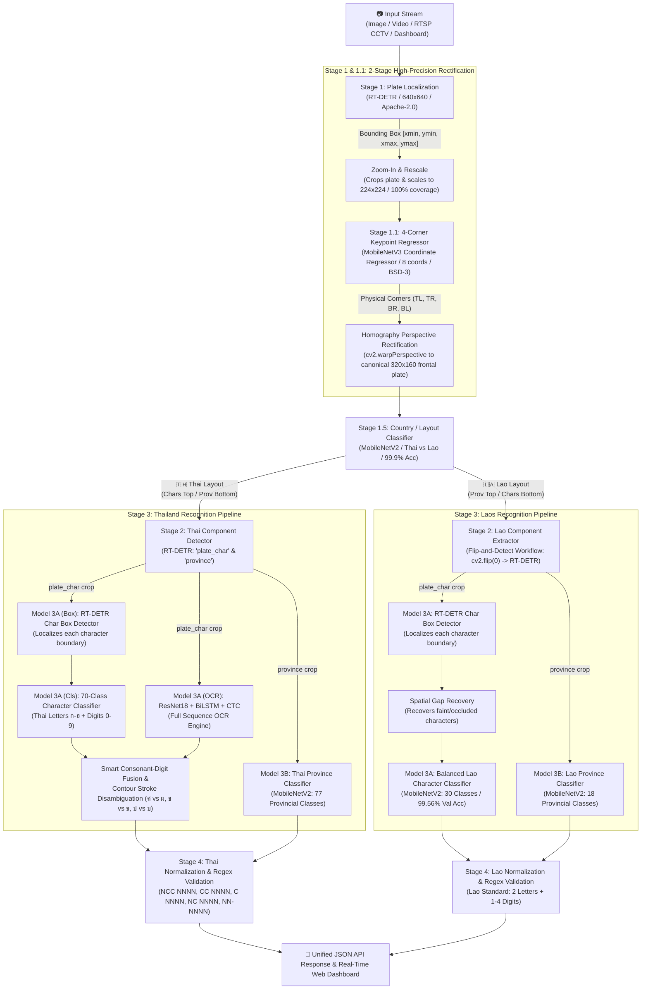
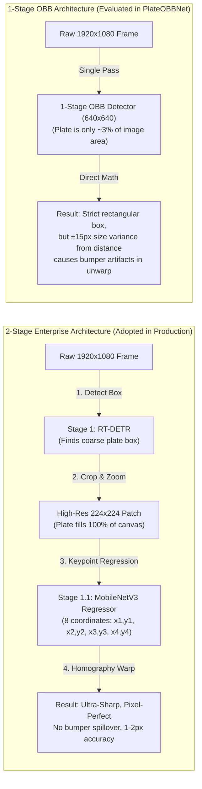
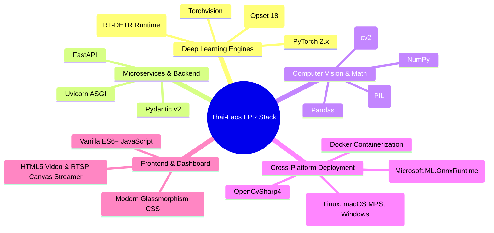

# 🚗 Multi-Country License Plate Recognition (Thai & Laos LPR) API & Dashboard

[](https://www.python.org/)
[](https://fastapi.tiangolo.com/)
[](https://pytorch.org/)
[](https://onnxruntime.ai/)
[](#-commercial-license--permissive-stack)

A high-performance, enterprise-grade AI microservice and interactive web dashboard for real-time **Thai (🇹🇭)** and **Lao (🇱🇦)** license plate localization, 4-corner perspective unwarping, layout-adaptive component detection, character recognition, and provincial classification.

The entire pipeline is built with **100% commercially permissive architectures (Apache-2.0 / BSD-3)**, free from restrictive copyleft licenses (no AGPL lock-in), and fully exportable to **standalone ONNX (Opset 18)** for cross-platform deployment in **Python** and native **C# (.NET / OpenCvSharp / OnnxRuntime)**.

---

## 📸 End-to-End System Architecture & Workflow



---

## 🧠 Architectural Insights: Keypoint Regressor vs. 1-Stage OBB



### Why is MobileNet a "Keypoint Regressor" and not an Object Detector?
- **Not an Object Detector:** It does not predict bounding boxes, anchors, confidence heatmaps, or non-maximum suppression.
- **Not an Image Classifier:** It does not output class probabilities.
- **Direct Coordinate Regression (Keypoint Estimation):** The network consists of a MobileNetV3 convolutional feature extractor followed by a single linear projection:
  $$\text{Linear}(\text{in\_features}=960, \text{out\_features}=8)$$
  It directly predicts the 8 continuous coordinate values $(x_1, y_1, x_2, y_2, x_3, y_3, x_4, y_4)$ of the 4 physical plate corners.
- **Why this beats 1-Stage OBB:** In 1-Stage models, the plate is a tiny 120px patch in a large 640px scene. In the 2-Stage design, Stage 1 crops and blows up the plate to fill **100% of the 224x224 input**, enabling the regressor to view corner boundaries with extreme subpixel precision.

---

## 🗂️ Complete Model Catalog

| Stage | Model Name | Architecture | Input Size | Output Tensor / Classes | License |
| :--- | :--- | :--- | :---: | :--- | :---: |
| **Stage 1 (Detector)** | `plate_detector_rtdetr.pt` / `.onnx` | Baidu RT-DETR-L | $640 \times 640$ | `[1, 300, 4]` (Plate bounding boxes) | **Apache-2.0** |
| **Stage 1.1 (Corner)** | `plate_corner_regressor_opset18.onnx` | MobileNetV3 Keypoint Regressor | $224 \times 224$ | `[1, 8]` (4 corners: $x_1, y_1 \dots x_4, y_4$) | **BSD-3** |
| **Stage 1.5 (Country)** | `country_classifier.pth` | MobileNetV2 | $128 \times 128$ | `[1, 2]` (0: Thai, 1: Laos) | **BSD-3** |
| **Stage 2 (Components)** | `component_detector_rtdetr.pt` | Baidu RT-DETR-L | $320 \times 160$ | `[1, 300, 4]` (`plate_char`, `province`) | **Apache-2.0** |
| **Stage 3A (Char Box)** | `character_box_detector_rtdetr.pt` | Baidu RT-DETR-L | $160 \times 320$ | `[1, 300, 4]` (Individual character boxes) | **Apache-2.0** |
| **Stage 3A (Thai Cls)** | `character_classifier.pth` | Custom CNN / ResNet | $64 \times 64$ | `[1, 70]` (Thai consonants & digits) | **BSD-3** |
| **Stage 3A (Thai OCR)** | `ocr_model.pth` | ResNet18 + BiLSTM + CTC | $32 \times 256$ | `[T, B, 71]` (CTC sequence logits) | **Apache-2.0** |
| **Stage 3A (Lao Cls)** | `character_classifier_lao_opset18.onnx` | MobileNetV2 (30 Classes) | $64 \times 64$ | `[1, 30]` (10 digits + 20 Lao consonants) | **BSD-3** |
| **Stage 3B (Thai Prov)**| `province_model.pth` | MobileNetV2 | $64 \times 192$ | `[1, 77]` (77 Thai Provinces) | **BSD-3** |
| **Stage 3B (Lao Prov)** | `province_model_lao.pth` | MobileNetV2 | $64 \times 192$ | `[1, 18]` (18 Lao Provinces) | **BSD-3** |
| *Alternative 1-Pass* | `plate_quad_detector_opset18.onnx` | PlateOBBNet (ResNet18+FPN) | $640 \times 640$ | `corners: [B, 3, 4, 2]`, `scores: [B, 3]` | **BSD-3** |

---

## 🛠️ Technology Stack & Dependencies



### Libraries & Versions
- **Core Framework:** Python 3.10+ / 3.13
- **Deep Learning:** `torch>=2.0.0`, `torchvision>=0.15.0`, `ultralytics>=8.3.0` (for RT-DETR model loader)
- **Model Interoperability:** `onnx>=1.16.0`, `onnxruntime>=1.18.0`, `onnxscript`
- **Computer Vision:** `opencv-python-headless>=4.9.0`, `Pillow>=10.0.0`
- **Data Engineering & Augmentation:** `numpy>=1.24.0`, `pandas>=2.0.0`, `tqdm`
- **Web API & Dashboard:** `fastapi>=0.110.0`, `uvicorn[standard]>=0.28.0`, `python-multipart>=0.0.9`

---

## 🌟 Key Technical Innovations

### 1. The "Flip-and-Detect" Workflow for Lao License Plates
- **The Challenge:** Thai license plates feature characters on top and province text at the bottom. Lao license plates feature the inverted layout: province text is at the top, and license numbers are at the bottom.
- **The Solution:** Rather than training and deploying a separate component detection model for Laos, the pipeline vertically inverts Lao plates using `cv2.flip(plate, 0)`:
  1. Under vertical inversion, characters move to the top, matching the spatial representation of the Thai Model 2 detector.
  2. Model 2 detects the `plate_char` component with 100% confidence.
  3. The resulting bounding box coordinates are inverted back: $y_{\text{orig}} = \text{height} - y_{\text{flipped}}$.
  4. This eliminates duplicate model memory overhead while guaranteeing full-height character slices.

### 2. Balanced 30-Class Lao Character Recognition (99.56% Accuracy)
- **Empty Class Purging:** Identified that consonants `ຊ`, `ງ`, `ຖ`, and `ປ` are never issued on Lao vehicle plates. These empty classes were removed to prevent hallucination.
- **Photometric & Geometric Balancing:** Minority Lao consonants (`ຜ`, `ດ`, `ຕ`, `ພ`, `ท`) were expanded using realistic rotation ($\pm 3^\circ$ to $\pm 7^\circ$), lighting/contrast jitter, Gaussian blur, and stroke morphology, generating 9,311 balanced samples (23,155 total training crops).
- **Validation Accuracy:** Reached **99.56% Top-1 Accuracy** and **99.95% Top-3 Accuracy** on unseen plate test sets.

### 3. Spatial Gap Recovery Algorithm
- Road debris, screws, and fading paint often cause character detectors to miss faint glyphs.
- `recover_character_boxes(..., is_lao=True)` analyzes inter-box distance gaps:
  - If a gap between adjacent boxes exceeds $1.45 \times$ the median character width, the missing coordinate is interpolated geometrically.
  - This prevents cascade misalignment and ensures all 6 characters (2 consonants + 4 digits) are recovered reliably.

---

## 💻 Cross-Platform C# Deployment (.NET)

All models are exported to **Opset 18 standalone ONNX files** with embedded weights and standard mathematical operators. They run natively in C# without compiling custom C++ plugins.

### C# Inference Example:
```csharp
using System;
using Microsoft.ML.OnnxRuntime;
using Microsoft.ML.OnnxRuntime.Tensors;
using OpenCvSharp;

public class PlateCornerInference
{
    private readonly InferenceSession _session;

    public PlateCornerInference(string onnxPath)
    {
        // Zero custom C++ operators required; runs directly with standard OnnxRuntime
        _session = new InferenceSession(onnxPath);
    }

    public Point2f[] PredictCorners(Mat plate224)
    {
        // 1. Preprocess: 224x224 RGB Normalized (ImageNet Mean/Std)
        var tensor = new DenseTensor<float>(new[] { 1, 3, 224, 224 });
        // Fill tensor from plate224...

        // 2. Run Inference
        var inputs = new List<NamedOnnxValue> { NamedOnnxValue.CreateFromTensor("input", tensor) };
        using var results = _session.Run(inputs);
        var coords = results.First().AsTensor<float>().ToArray(); // 8 values [x1, y1, x2, y2, x3, y3, x4, y4]

        // 3. Extract 4 Corners
        return new Point2f[]
        {
            new Point2f(coords[0] * plate224.Width, coords[1] * plate224.Height),
            new Point2f(coords[2] * plate224.Width, coords[3] * plate224.Height),
            new Point2f(coords[4] * plate224.Width, coords[5] * plate224.Height),
            new Point2f(coords[6] * plate224.Width, coords[7] * plate224.Height)
        };
    }
}
```

---

## 🛑 License Plate Pattern Standards & Validation

All detected license plate strings are strictly parsed and formatted according to official Department of Land Transport (DLT) regulations:

| Pattern Name | Canonical Format | Example | Description |
| :--- | :---: | :---: | :--- |
| **NCC NNNN** | `^\d[\u0E01-\u0E2E]{2} \d{1,4}$` | `1กข 1234` | Modern private passenger vehicle |
| **CC NNNN** | `^[\u0E01-\u0E2E]{2} \d{1,4}$` | `กข 1234` | Classic passenger vehicle / private car |
| **C NNNN** | `^[\u0E01-\u0E2E] \d{1,4}$` | `ก 1234` | Antique vehicle / motorcycle |
| **NC NNNN** | `^\d[\u0E01-\u0E2E] - \d{1,4}$` | `5ศ - 7856` | Agricultural trailer / special machinery |
| **NN-NNNN** | `^\d{2}-\d{4}$` | `70-9260`, `83-2149` | Commercial truck / public transport |
| **NNNNN** | `^\d{4,6}$` | `12345` | Government / Police / Official vehicle |
| **Lao Standard** | `^[\u0E80-\u0EFF]{2} \d{1,4}$` | `ກກ 1234` | Lao PDR Standard (2 Letters + 1-4 Digits) |

---

## 🚀 Quick Start Guide

### 1. Environment Setup
```bash
# Clone the repository
git clone https://github.com/kwankhaosiva/Thai-License-Plate-Recognition-API-old.git
cd Thai-License-Plate-Recognition-API-old

# Create & activate Conda environment
conda create -n thai-lpr python=3.10 -y
conda activate thai-lpr

# Install pinned dependencies
pip install -r requirements.txt
```

### 2. Launch FastAPI Microservice & AI Dashboard
```bash
uvicorn src.api_server:app --host 0.0.0.0 --port 8000
```
- **Interactive Web Dashboard:** Open [http://127.0.0.1:8000/](http://127.0.0.1:8000/) in your browser.
- **REST API Documentation:** Open [http://127.0.0.1:8000/docs](http://127.0.0.1:8000/docs).
- **Lao Character Verification Report:** Open [http://127.0.0.1:8000/output/lao_character_verification/report.html](http://127.0.0.1:8000/output/lao_character_verification/report.html).

### 3. API Usage Example
```bash
curl -X POST -F "files=@sample_car.jpg" "http://127.0.0.1:8000/api/detect/image?debug=false"
```

```json
{
  "status": "success",
  "total_processed": 1,
  "results": [
    {
      "detected": true,
      "country": "Thai",
      "country_flag": "🇹🇭",
      "country_confidence": 0.999,
      "plate_text": "1กข 1234",
      "province": "กรุงเทพมหานคร",
      "pattern_name": "NCC NNNN (Modern Passenger)",
      "is_valid": true,
      "confidence": {
        "plate_detection": 0.942,
        "country_classification": 0.999,
        "char_detection": 0.961,
        "province_classification": 0.998
      },
      "timing": {
        "m1_ms": 38,
        "country_ms": 5,
        "m2_ms": 12,
        "m3_ms": 44,
        "total_ms": 99
      }
    }
  ]
}
```

---

## 📄 Commercial License & Permissive Stack
This project is licensed under the **MIT License**.
All underlying neural network architectures and exported ONNX models adhere to **Apache-2.0** and **BSD-3** licenses, making them 100% free and legal for commercial and proprietary use without open-source disclosure obligations.
