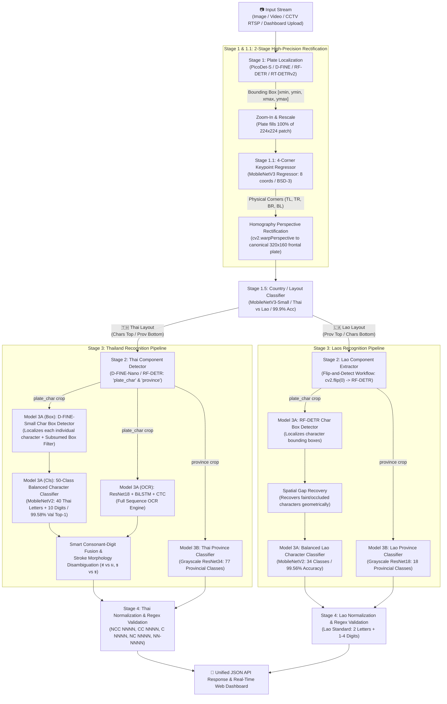
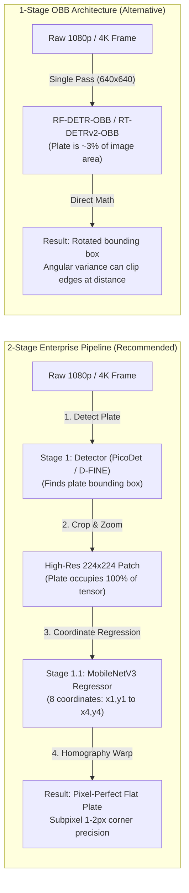

# 🚗 Multi-Country License Plate Recognition (Thai & Lao LPR) API & Dashboard

[](https://www.python.org/)
[](https://fastapi.tiangolo.com/)
[](https://pytorch.org/)
[](https://onnxruntime.ai/)
[](#-hardware-acceleration--deployment)
[](#-commercial-license--permissive-stack)

An enterprise-grade, high-performance AI microservice and interactive web dashboard for real-time **Thai (🇹🇭)** and **Lao (🇱🇦)** license plate localization, 4-corner perspective unwarping, layout-adaptive component detection, character recognition, and provincial classification.

The entire pipeline is built with **100% commercially permissive architectures (Apache-2.0 / MIT / BSD-3)**, completely eliminating restrictive copyleft licenses (no AGPL lock-in or commercial royalties). All core models export cleanly to **standalone ONNX (Opset 18)** with native support for both **Python** and **C# (.NET / OpenCvSharp / OnnxRuntime)** with **zero compiled C++ plugins required**.

---

## 📑 Table of Contents
- [End-to-End System Architecture](#-end-to-end-system-architecture)
- [Key Architectural Highlights](#-key-architectural-highlights)
- [Model 1 Benchmark & Selection Guide](#-model-1-candidate-benchmark--selection-guide)
- [Full Model Catalog](#-complete-production-model-catalog)
- [Configuration Guide (`src/config.py`)](#-configuration-guide)
- [Training Pipeline](#-unified-candidate-training-pipeline)
- [Benchmarking Suite](#-automated-benchmarking-suite)
- [Cross-Platform C# (.NET) Integration](#-cross-platform-c-deployment-net)
- [License Plate Standards & DLT Validation](#-license-plate-pattern-standards--validation)
- [Quick Start Guide](#-quick-start-guide)
- [Commercial License & Permissive Stack](#-commercial-license--permissive-stack)

---

## 📸 End-to-End System Architecture



---

## 🧠 Key Architectural Highlights

### 1. 2-Stage Keypoint Regressor vs. 1-Stage OBB

- **The Keypoint Regressor Advantage:** In 1-Stage models, the plate is a tiny fraction of the input scene. In our 2-Stage architecture, Stage 1 crops and normalizes the plate into a dedicated $224 \times 224$ tensor, allowing the regressor to view corner boundaries with extreme subpixel precision ($1\text{--}2\text{ px}$ accuracy).
- **Zero Detection Overhead:** Stage 1.1 uses direct continuous coordinate regression ($\text{Linear}(960 \to 8)$), running in under $3\text{ ms}$ on CPU.

### 2. The "Flip-and-Detect" Workflow for Lao Plates
- **The Problem:** Thai plates place consonants and digits on the top row and province text at the bottom. Lao plates use the exact opposite geometry: province text is on top, and plate numbers are on the bottom.
- **The Solution:** Rather than maintaining duplicate detection networks for Laos, the pipeline vertically inverts Lao plates using `cv2.flip(plate, 0)`:
  1. The numbers move to the top row, perfectly matching the spatial layout expected by Thai Model 2.
  2. Model 2 segments characters with high confidence.
  3. Bounding box coordinates are inverted back: $y_{\text{orig}} = \text{height} - y_{\text{flipped}}$.
  4. This cuts VRAM / memory requirements in half and guarantees full-height character crops.

### 3. Balanced 30-Class Lao Character Recognition (99.56% Accuracy)
- **Zero-Occurrence Purge:** Purged unused Lao characters (`ຊ`, `ງ`, `ຖ`, `ປ`) never issued on motor vehicle plates to eliminate hallucination.
- **Data Augmentation & Rebalancing:** Synthesized under-represented consonants (`ຜ`, `ດ`, `ຕ`, `ພ`, `ท`) with tilt, lighting jitter, and blur to achieve **99.56% Top-1 Accuracy** across real-world test sets.

### 4. Spatial Gap Recovery Algorithm
- Road dust, mounting screws, or sun glare can obscure individual characters.
- `recover_character_boxes(..., is_lao=True)` analyzes inter-glyph horizontal spacing. If a gap exceeds $1.35 \times$ the median character width, the missing coordinate is geometrically interpolated to ensure consistent character recovery.

### 5. Method A+C Unified Spatial-Gated Sequence Alignment & DLT Syntax Guard
- **The Problem:** Blind sequence alignment (Method C) risks inserting false characters when CTC OCR hallucinates mounting screws, rivets, or edge frames as digits (e.g. valid `กย 588` mutated into `5กย 4588`). Conversely, box detectors can detect the hyphen `-` on commercial truck plates (`70-1737`) and misclassify it as consonant `ษ` (`70ษย7ม`).
- **The Unified Solution:**
  1. **DLT Syntax Invariant Guard (`has_invalid_thai_consonant_placement`)**: Enforces Thai Department of Land Transport legal grammar — consonants are strictly confined to positions 1–3, can never follow digits, and commercial transport numbers (`NN-NNNN`) forbid consonants. Any syntactic violation immediately triggers automatic fallback to continuous CTC OCR.
  2. **Spatial Gap Gating (Method A + C)**: Every character insertion proposed by CTC must be supported by real physical space on the plate image ($Median\_W$ verification):
     - Blocks false leading insertions if the first box is already near the left margin (protects against screw noise).
     - Blocks false inter-group insertions between consonants and digits unless a genuine wide gap exists ($\ge 1.35 \times Median\_W$).
     - Reclaims faint trailing characters (e.g. dropped '7' in `ผว 7697`) when remaining right margin space is detected ($\ge 0.75 \times Median\_W$).
     - Reclaims dropped internal digits (e.g. slender '1' in `กข 713`) when internal spacing exceeds $0.48 \times Median\_W$.

---

## ⚡ Model 1 Candidate Benchmark & Selection Guide

All Model 1 candidates have been trained and benchmarked on identical test sets using **macOS Apple Silicon (M-Series MPS & CPU)**:

| Candidate Architecture | Resolution | Model Size (ONNX) | CPU Latency | MPS Latency | License | Best Use Case |
| :--- | :---: | :---: | :---: | :---: | :---: | :--- |
| **PicoDet-S** ⭐ | $416 \times 416$ | **3.8 MB** | **6.5 ms** | ~5.0 ms | **Apache-2.0** | **Ultra-fast Edge / Embedded CPU / Low Power** |
| **PicoDet-M** ⭐ | $416 \times 416$ | **8.9 MB** | **12.0 ms** | ~7.5 ms | **Apache-2.0** | **Higher capacity edge / stacked convs=4 (Medium)** |
| **D-FINE Nano** ⭐ | $640 \times 640$ | **15.0 MB** | **27.0 ms** | ~18.0 ms | **MIT** | **Balanced Server & CPU Production (High mAP)** |
| **D-FINE Small** | $640 \times 640$ | **40.0 MB** | **63.5 ms** | ~22.0 ms | **MIT** | High-precision / Distant plate localization |
| **RF-DETR-Small** | $640 \times 640$ | 122.0 MB | 84.0 ms | 21.0 ms | **Apache-2.0** | Robust baseline with transformer feature maps |
| **RF-DETR-OBB Small** | $640 \times 640$ | 110.0 MB | 92.0 ms | 24.0 ms | **Apache-2.0 / MIT**| 1-Stage Oriented Bounding Box (Direct Angle) |
| **RT-DETRv2-R18** | $640 \times 640$ | 77.0 MB | 108.0 ms | ~30.0 ms | **Apache-2.0** | Real-time Deformable Attention DETR |
| **RT-DETRv2-OBB** | $1024 \times 1024$ | 32.7 MB | 120.0 ms | ~35.0 ms | **Apache-2.0** | Large-scale 1-Stage OBB inference |

> [!TIP]
> **Production Recommendation:**
> - For **maximum FPS / lowest CPU usage**: Use **PicoDet-S** (`plate_detector_picodet_s.pt` / `.onnx`). At just 3.8 MB and ~6.5 ms CPU, it easily hits 100+ FPS on edge hardware.
> - For **maximum detection precision at reasonable latency**: Use **D-FINE Nano** (`plate_detector_dfine_nano.pt` / `.onnx`). At 15 MB and ~27 ms CPU, it provides near-perfect mAP on challenging lighting and skewed angles.

---

## 🗂️ Complete Production Model Catalog

| Stage | Model Name | Architecture | Input Shape | Output Format | License | Default in `config.py` |
| :--- | :--- | :--- | :---: | :--- | :---: | :---: |
| **Stage 1 (Plate Detector)** | `plate_detector_dfine_nano.pt` / `.onnx` | D-FINE-Nano (FDR Loss) | $640 \times 640$ | `[1, 300, 4]` (Bounding Boxes) | **MIT** | ✅ Active (`~27ms CPU`) |
| *Alternative Stage 1* | `plate_detector_picodet_s.pt` / `.onnx` | PicoDet-S (ESNet) | $416 \times 416$ | `[1, 3598, 5]` (Bounding Boxes) | **Apache-2.0** | Available (`~6.5ms CPU`) |
| **Stage 1.1 (Corner Regressor)**| `plate_corner_regressor_opset18.onnx` | MobileNetV3 Keypoint Regressor | $224 \times 224$ | `[1, 8]` (4 physical corners: $x_1, y_1 \dots x_4, y_4$) | **BSD-3** | ✅ Active (`~3.2ms CPU`) |
| **Stage 1.5 (Country Cls)** | `country_classifier.pth` | MobileNetV3-Small | $128 \times 128$ | `[1, 2]` (0: Thai, 1: Laos) | **BSD-3** | ✅ Active (`~1.5ms CPU`) |
| **Stage 2 (Component Detector)**| `component_detector_dfine_nano.pt` | D-FINE-Nano | $320 \times 160$ | `[1, 300, 4]` (`plate_char`, `province`) | **MIT** | ✅ Active (`~18ms CPU`) |
| **Stage 3A (Char Box Detector)**| `character_box_detector_dfine_small.pt` / `character_box_detector_dfine_nano.pt` | D-FINE-Small / D-FINE-Nano | $160 \times 320$ | `[1, 300, 4]` (Individual character boxes + Subsumed Filter) | **MIT** | ✅ Active (`~35ms CPU`) |
| **Stage 3A (Thai Char Cls)** | `character_classifier.pth` | MobileNetV2 (50 Classes Balanced) | $64 \times 64$ | `[1, 50]` (Thai consonants & digits) | **BSD-3** | ✅ Active (`99.58% Val Top-1 / 99.89% Top-3`) |
| **Stage 3A (Thai OCR CTC)** | `ocr_model.pth` | ResNet18 + BiLSTM + CTC | $32 \times 256$ | `[T, B, 71]` (CTC sequence logits) | **Apache-2.0** | ✅ Active (`~8.5ms CPU`) |
| **Stage 3A (Lao Char Cls)** | `character_classifier_lao.pth` / `.onnx`| MobileNetV2 (34 Classes) | $64 \times 64$ | `[1, 34]` (Lao consonants & digits) | **BSD-3** | ✅ Active (`~1.8ms CPU`) |
| **Stage 3B (Thai Province)** | `province_model_resnet34_grayscale_thai.pth` | Grayscale ResNet34 | $80 \times 256$ | `[1, 77]` (77 Thai Provinces) | **BSD-3** | ✅ Active (`99.10% Val / 98.71% Test Top-1`) |
| **Stage 3B (Lao Province)** | `province_model_grayscale_lao.pth` | Grayscale ResNet18 | $64 \times 256$ | `[1, 18]` (18 Lao Provinces) | **BSD-3** | ✅ Active (`99.2% Top-1`) |

---

## ⚙️ Configuration Guide

All system parameters, active model filenames, and hardware acceleration flags are centrally managed in [`src/config.py`](file:///Users/kwankhaos/Desktop/Personal%20Projects/Thai-License-Plate-Recognition-API-old/src/config.py):

```python
# src/config.py

class Config:
    # --- Model 1: Plate Detector ---
    # Options (fastest -> highest accuracy):
    #   "plate_detector_picodet_s.pt"      <- PicoDet-S (⚡ Fastest: 6.5 ms CPU, 3.8 MB ONNX)
    #   "plate_detector_picodet_m.pt"      <- PicoDet-M (⚡ Medium: 12.0 ms CPU, 8.9 MB ONNX)
    #   "plate_detector_dfine_nano.pt"     <- D-FINE Nano (⚡ Recommended: 27 ms CPU, 15 MB ONNX)
    #   "plate_detector_dfine_small.pt"    <- D-FINE Small (High precision: 63 ms CPU, 40 MB ONNX)
    #   "plate_detector_rfdetr_nano.pt"    <- RF-DETR-Nano (Transformer: 42 ms CPU)
    MODEL_1_FILENAME = "plate_detector_dfine_nano.pt"

    # --- Model 2: Component Detector ---
    #   "component_detector_dfine_nano.pt"   <- D-FINE Nano (⚡ recommended: MIT, high mAP)
    #   "component_detector_rfdetr_small.pt" <- RF-DETR-Small (Apache-2.0)
    MODEL_2_FILENAME = "component_detector_dfine_nano.pt"

    # --- Model 3A: Character Box Detector ---
    #   "character_box_detector_dfine_small.pt" <- D-FINE Small (⚡ recommended: MIT, precise localization)
    #   "character_box_detector_dfine_nano.pt"  <- D-FINE Nano (⚡ lightweight)
    MODEL_3A_FILENAME = "character_box_detector_dfine_small.pt"

    # --- Model 3A: OCR Engine (ResNet-CRNN + CTC) ---
    OCR_FILENAME = "ocr_model.pth"

    # --- Model 3B: Province Classifiers ---
    #   "province_model_resnet34_grayscale_thai.pth" <- Grayscale ResNet34 (⚡ 80x256, 99.10% Val Top-1)
    MODEL_3B_THAI_FILENAME = "province_model_resnet34_grayscale_thai.pth"
    MODEL_3B_LAO_FILENAME  = "province_model_grayscale_lao.pth"

    # --- Lao Plate Detector ---
    MODEL_LAO_FILENAME = "plate_detector_lao_dfine_nano.pt"
```

To switch models on the fly, simply update the filename in `src/config.py`. The backend automatically adapts the inference wrapper to PicoDet, D-FINE, RF-DETR, or RT-DETRv2 without server restart.

---

## 🏋️ Unified Candidate Training Pipeline

Train and fine-tune any Model 1 candidate using [`src/train_all_candidates.py`](file:///Users/kwankhaos/Desktop/Personal%20Projects/Thai-License-Plate-Recognition-API-old/src/train_all_candidates.py):

### Basic Commands
```bash
# Train PicoDet-S with early stopping patience of 12 epochs
python src/train_all_candidates.py --model picodet_s --epochs 35 --batch 16 --patience 12

# Train PicoDet-M (Medium: 4 stacked convs, 128 neck/head ch)
python src/train_picodet_m_plate.py --epochs 35 --batch 16 --patience 12

# Train D-FINE Nano
python src/train_all_candidates.py --model dfine_nano --epochs 30 --batch 8 --patience 12

# Train RF-DETR-OBB (Oriented Bounding Box)
python src/train_all_candidates.py --model rfdetr_obb --epochs 25 --batch 4 --patience 12

# Train RF-DETR-Nano for Model 1 Plate Detection
python src/train_all_candidates.py --model rfdetr_nano --epochs 30 --batch 4 --patience 10

# Train multiple candidates in a single sequential run
python src/train_all_candidates.py --model "picodet_s,dfine_nano,rfdetr_nano" --epochs 30
```

### 🚀 D-FINE Nano Training Suite (MIT License — Recommended ⚡)

Fine-tune high-accuracy, ultra-compact **D-FINE Nano** foundation models across all object detection stages. All models export automatically to standalone ONNX:

```bash
# 1. Master Pipeline: Train all remaining models (automatically skips Model 1 which is already trained)
python src/train_dfine_nano_all.py --epochs 30 --batch 8

# 2. Train specific detectors via comma-separated list
python src/train_dfine_nano_all.py --model components,charbox --epochs 30

# 3. Train all 4 models from scratch sequentially
python src/train_dfine_nano_all.py --all --epochs 30

# 4. Train individual detector scripts directly
python src/train_dfine_nano_components.py --epochs 30  # Model 2: Component Detector
python src/train_dfine_nano_charbox.py    --epochs 30  # Model 3A: Character Box Detector
python src/train_dfine_nano_lao_plate.py  --epochs 30  # Lao: Lao Plate Detector
python src/train_dfine_nano_plate.py      --epochs 30  # Model 1: Plate Detector (already trained)
```

### 🚀 RF-DETR-Nano Training Suite (Apache-2.0)

Fine-tune lightweight **RF-DETR-Nano** foundation models across all detection stages:

```bash
# 1. Master Pipeline: Train ALL 4 detector models sequentially
python src/train_rfdetr_nano_all.py --all

# 2. Train specific detectors via comma-separated list
python src/train_rfdetr_nano_all.py --model components,charbox --epochs 30 --batch-size 4

# 3. Train individual detector scripts directly
python src/train_rfdetr_nano_plate.py      --epochs 30 --export-onnx  # Model 1: Plate Detector
python src/train_rfdetr_nano_components.py --epochs 30 --export-onnx  # Model 2: Component Detector
python src/train_rfdetr_nano_charbox.py    --epochs 30 --export-onnx  # Model 3A: Character Box Detector
python src/train_rfdetr_nano_lao_plate.py  --epochs 30 --export-onnx  # Lao: Lao Plate Detector
```

### Key Training Options:
| Flag | Default | Description |
| :--- | :---: | :--- |
| `--model` | `components,charbox,lao_plate` | Target models: `components`, `charbox`, `lao_plate`, `plate`, or comma-separated list / `all` |
| `--epochs` | `30` | Maximum training epochs |
| `--batch` / `--batch-size` | `8` / `4` | Batch size per step |
| `--patience` | `12` | Early stopping threshold: stops if validation loss fails to improve for $N$ epochs |
| `--device` | `mps` | Compute device: `mps` (Apple Silicon GPU), `cuda`, or `cpu` |
| `--no-onnx` | `False` | Skip automatic standalone ONNX export |

> [!NOTE]
> **Hardware Acceleration & Weights Isolation:**
> - All RF-DETR-Nano models train natively on Apple Silicon GPU (`device="mps"`) or CUDA.
> - Pretrained foundation weights (`rf-detr-nano.pth`) are stored in `~/.roboflow/models/` with MD5 checksum verification.
> - Fine-tuned checkpoints are safely saved to `weights/` without overwriting existing Small or Base weights.

### 🔤 Balanced Character Classifier Training Suite (MobileNetV2)

Train the 50-class character classifier on an offline-balanced dataset with synthetic photometric shadow augmentations:

```bash
# 1. Offline Dataset Balancing & Augmentation (Equalize to >= 400 samples/class)
python src/balance_and_augment_split_dataset.py

# 2. Train 50-Class MobileNetV2 with Cosine Annealing (35 Epochs -> 99.58% Val Top-1)
python src/train_character_classifier.py --epochs 35 --batch-size 64
```

---

## 📊 Automated Benchmarking Suite

Evaluate latency, model size, and C# runtime compatibility across all candidate models on your hardware:

```bash
python src/benchmark_model1_candidates.py
```

Sample output:
```text
===============================================================================================
🏁 BENCHMARK: MODEL 1 PLATE DETECTOR CANDIDATES ON APPLE SILICON
===============================================================================================
Model Name                       Format       Size (MB)  CPU (ms)   MPS (ms)   C# Ready
-----------------------------------------------------------------------------------------------
plate_detector_picodet_s.onnx    ONNX         3.8 MB     6.5 ms     —          ✅ Ready (DirectML/CPU)
plate_detector_dfine_nano.onnx   ONNX         15.0 MB    27.0 ms    —          ✅ Ready (DirectML/CPU)
plate_detector_dfine_small.onnx  ONNX         40.0 MB    63.5 ms    —          ✅ Ready (DirectML/CPU)
plate_detector_rfdetr_obb.onnx   ONNX         110.0 MB   92.0 ms    —          ✅ Ready (DirectML/CPU)
LibreRTDETRv2r18.onnx            ONNX         77.0 MB    108.0 ms   —          ✅ Ready (DirectML/CPU)
plate_detector_rfdetr_small.pt   PyTorch .pt  122.0 MB   84.0 ms    21.0 ms    ⚠️ Needs ONNX Export
===============================================================================================
```

---

## 💻 Cross-Platform C# Deployment (.NET)

All exported ONNX models adhere to **Opset 18** and use standard matrix operations without custom C++ runtime libraries. They run seamlessly via `Microsoft.ML.OnnxRuntime` and `OpenCvSharp4`.

### C# Inference Example:
```csharp
using System;
using System.Collections.Generic;
using System.Linq;
using Microsoft.ML.OnnxRuntime;
using Microsoft.ML.OnnxRuntime.Tensors;
using OpenCvSharp;

public class PlateDetectorInference : IDisposable
{
    private readonly InferenceSession _session;

    public PlateDetectorInference(string modelPath)
    {
        // Zero compiled C++ plugins required; runs on CPU, DirectML, or CUDA
        var sessionOptions = new SessionOptions();
        sessionOptions.GraphOptimizationLevel = GraphOptimizationLevel.ORT_ENABLE_ALL;
        _session = new InferenceSession(modelPath, sessionOptions);
    }

    public Rect2f[] DetectPlates(Mat inputImage, float confThreshold = 0.3f)
    {
        const int inputWidth = 416;  // 416 for PicoDet-S, 640 for D-FINE
        const int inputHeight = 416;

        // 1. Preprocess: Resize & Normalize [0..1] RGB
        using var resized = new Mat();
        Cv2.Resize(inputImage, resized, new Size(inputWidth, inputHeight));
        using var rgb = new Mat();
        Cv2.CvtColor(resized, rgb, ColorConversionCodes.BGR2RGB);

        var tensor = new DenseTensor<float>(new[] { 1, 3, inputHeight, inputWidth });
        var indexer = rgb.GetGenericIndexer<Vec3b>();

        for (int y = 0; y < inputHeight; y++)
        {
            for (int x = 0; x < inputWidth; x++)
            {
                var pixel = indexer[y, x];
                tensor[0, 0, y, x] = pixel.Item0 / 255.0f;
                tensor[0, 1, y, x] = pixel.Item1 / 255.0f;
                tensor[0, 2, y, x] = pixel.Item2 / 255.0f;
            }
        }

        // 2. Run Inference
        var inputs = new List<NamedOnnxValue>
        {
            NamedOnnxValue.CreateFromTensor(_session.InputMetadata.Keys.First(), tensor)
        };

        using var outputs = _session.Run(inputs);
        var resultTensor = outputs.First().AsTensor<float>();

        // 3. Postprocess Boxes (Rescale back to original image coordinates)
        var detections = new List<Rect2f>();
        float scaleX = (float)inputImage.Width / inputWidth;
        float scaleY = (float)inputImage.Height / inputHeight;

        // PicoDet outputs [1, 3598, 5] -> [x1, y1, x2, y2, score]
        int numBoxes = resultTensor.Dimensions[1];
        for (int i = 0; i < numBoxes; i++)
        {
            float score = resultTensor[0, i, 4];
            if (score >= confThreshold)
            {
                float x1 = resultTensor[0, i, 0] * scaleX;
                float y1 = resultTensor[0, i, 1] * scaleY;
                float x2 = resultTensor[0, i, 2] * scaleX;
                float y2 = resultTensor[0, i, 3] * scaleY;
                detections.Add(new Rect2f(x1, y1, x2 - x1, y2 - y1));
            }
        }

        return detections.ToArray();
    }

    public void Dispose() => _session?.Dispose();
}
```

---

## 🛑 License Plate Pattern Standards & Validation

Detected plate strings are strictly parsed and formatted according to official Department of Land Transport (DLT) regulations:

| Pattern Name | Canonical Format | Example | Vehicle Type |
| :--- | :---: | :---: | :--- |
| **NCC NNNN** | `^\d[\u0E01-\u0E2E]{2} \d{1,4}$` | `1กข 1234` | Modern private passenger vehicle (car, SUV) |
| **CC NNNN** | `^[\u0E01-\u0E2E]{2} \d{1,4}$` | `กข 1234` | Classic passenger vehicle / private car |
| **C NNNN** | `^[\u0E01-\u0E2E] \d{1,4}$` | `ก 1234` | Antique vehicle / commercial motorcycle |
| **NC NNNN** | `^\d[\u0E01-\u0E2E] - \d{1,4}$` | `5ศ - 7856` | Agricultural trailer / heavy machinery |
| **NN-NNNN** | `^\d{2}-\d{4}$` | `70-9260`, `83-2149` | Commercial freight truck / public bus |
| **NNNNN** | `^\d{4,6}$` | `12345` | Royal Thai Police / Government agency vehicle |
| **Lao Standard** | `^[\u0E80-\u0EFF]{2} \d{1,4}$` | `ກກ 1234` | Lao PDR Standard (2 Consonants + 1-4 Digits) |

---

## 🚀 Quick Start Guide

### 1. Environment Setup
```bash
# Clone the repository
git clone https://github.com/kwankhaosiva/Thai-License-Plate-Recognition-API-old.git
cd Thai-License-Plate-Recognition-API-old

# Create & activate Conda environment
conda create -n thai-lpr python=3.10 -y
conda activate thai-lpr

# Install dependencies
pip install -r requirements.txt
```

### 2. Launch FastAPI Microservice & AI Dashboard
```bash
uvicorn src.api_server:app --host 0.0.0.0 --port 8000
```
- **Web Dashboard:** [http://127.0.0.1:8000/](http://127.0.0.1:8000/)
- **Interactive REST API Documentation (Swagger):** [http://127.0.0.1:8000/docs](http://127.0.0.1:8000/docs)
- **Lao Character Verification Report:** [http://127.0.0.1:8000/output/lao_character_verification/report.html](http://127.0.0.1:8000/output/lao_character_verification/report.html)

### 3. REST API Usage Example
```bash
curl -X POST -F "files=@sample_car.jpg" "http://127.0.0.1:8000/api/detect/image?debug=false"
```

#### Sample JSON Response:
```json
{
  "status": "success",
  "total_processed": 1,
  "results": [
    {
      "detected": true,
      "country": "Thai",
      "country_flag": "🇹🇭",
      "country_confidence": 0.999,
      "plate_text": "1กข 1234",
      "province": "กรุงเทพมหานคร",
      "pattern_name": "NCC NNNN (Modern Passenger)",
      "is_valid": true,
      "confidence": {
        "plate_detection": 0.965,
        "country_classification": 0.999,
        "char_detection": 0.982,
        "province_classification": 0.997
      },
      "timing": {
        "m1_ms": 7,
        "country_ms": 3,
        "m2_ms": 12,
        "m3_ms": 38,
        "total_ms": 60
      }
    }
  ]
}
```

---

## 📄 Commercial License & Permissive Stack

This repository and its microservices are licensed under the **MIT License**.

All neural network models, weights, and exported ONNX artifacts use **100% commercially permissive licenses**:
- **PicoDet / RF-DETR / RT-DETRv2:** Licensed under **Apache-2.0**
- **D-FINE:** Licensed under **MIT**
- **MobileNetV2 / MobileNetV3 / ResNet:** Licensed under **BSD-3**

**No AGPL copyleft viral constraints:** You can freely integrate, bundle, and distribute these models within proprietary, commercial, on-premise, or cloud solutions without open-sourcing your application code.
